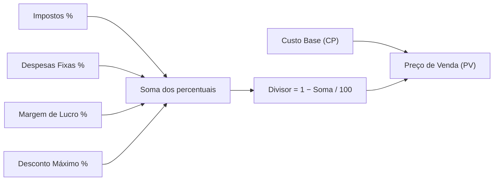
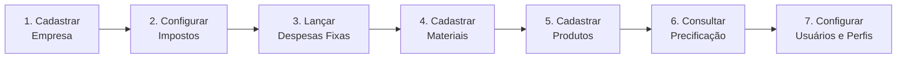

# 1. Visão geral do sistema

> **Contexto:** este documento faz parte do *Manual de Utilização — Sistema Markup*, uma ferramenta de precificação estratégica. Veja o índice completo em [`00-indice.md`](./00-indice.md).

O Markup é um sistema de **precificação estratégica** baseado no método **Markup por Divisor**. Em vez de multiplicar o custo por um fator, o sistema **divide** o custo por um número menor que 1, calculado a partir da soma de todos os percentuais que o preço final precisa cobrir:

```
PV = CP / [1 − (Impostos% + Despesas Fixas% + Margem de Lucro% + Desconto Máximo%) / 100]
```

| Sigla | Significado |
|---|---|
| **PV** | Preço de Venda (o que o cliente paga) |
| **CP** | Custo de Produção (soma dos materiais/insumos usados no produto) |
| **Impostos** | Soma das alíquotas dos impostos vinculados ao produto |
| **DF** | Despesas Fixas rateadas — calculado automaticamente pelo sistema |
| **ML** | Margem de Lucro desejada, definida por produto |
| **D** | Desconto Máximo que a equipe de vendas pode conceder sem corroer a margem |

O diagrama abaixo mostra como cada componente entra na fórmula, do custo até o preço final:



O sistema é organizado por **segmento de negócio** — Confeitaria 🧁, Indústria 🏭 ou Serviços 🛠️ — que muda apenas os rótulos das telas (ex.: "Ingrediente" vs "Matéria-prima" vs "Custo direto"), mas não a fórmula.

## Fluxo de trabalho recomendado

O fluxo de trabalho recomendado para colocar a empresa em produção é:



Cada uma dessas etapas tem um documento próprio neste manual:

1. Cadastro da empresa → [`04-cadastro-empresa.md`](./04-cadastro-empresa.md)
2. Configuração de impostos → [`05-impostos.md`](./05-impostos.md)
3. Despesas fixas → [`06-despesas-fixas.md`](./06-despesas-fixas.md)
4. Materiais → [`07-materiais-insumos.md`](./07-materiais-insumos.md)
5. Produtos → [`08-produtos-ficha-tecnica.md`](./08-produtos-ficha-tecnica.md)
6. Precificação → [`09-precificacao.md`](./09-precificacao.md)
7. Usuários e Perfis → [`13-usuarios.md`](./13-usuarios.md) e [`14-perfis-rbac.md`](./14-perfis-rbac.md)

Antes de operar o sistema, veja também [`02-login.md`](./02-login.md) e [`03-navegacao-e-troca-de-empresa.md`](./03-navegacao-e-troca-de-empresa.md).
