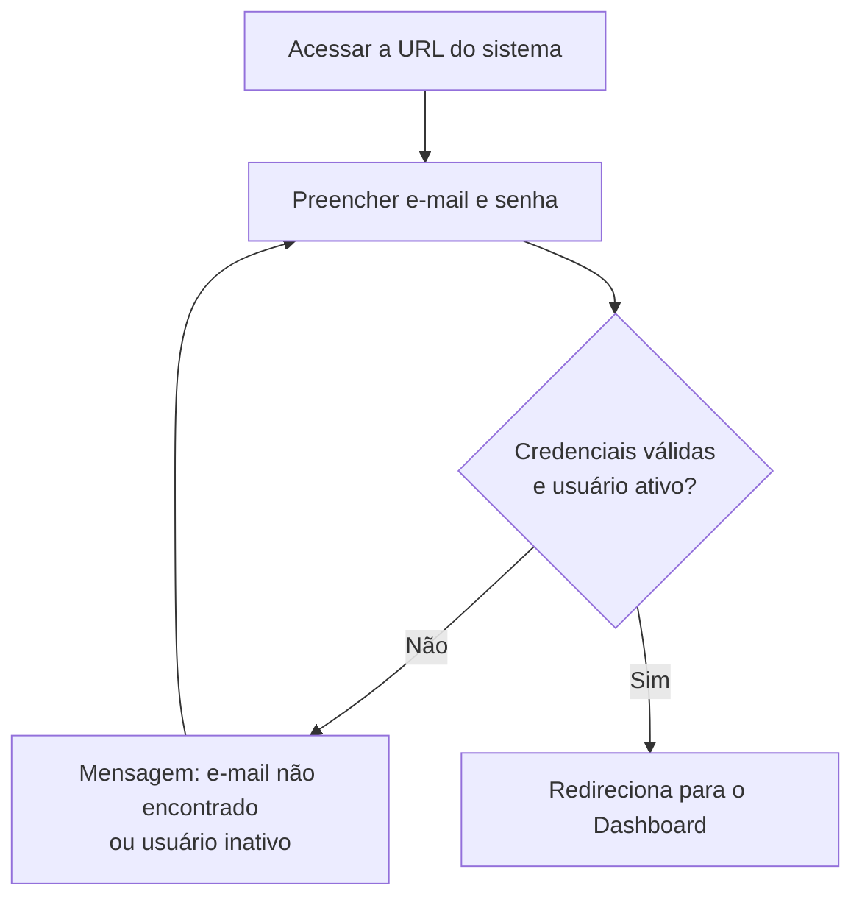

# 2. Acesso ao sistema (login)

> **Contexto:** este documento faz parte do *Manual de Utilização — Sistema Markup*, ferramenta de precificação estratégica por Markup Divisor (`PV = CP / Divisor`). Veja o índice completo em [`00-indice.md`](./00-indice.md).

1. Acesse a URL do sistema. Você verá a tela **"Boas-vindas de volta"** com o logo **Markup**.
2. Preencha:
   - **E-mail**
   - **Senha**
3. Clique em **"Entrar no sistema"**.
4. Se as credenciais estiverem incorretas ou o usuário estiver **inativo**, aparece a mensagem: *"E-mail não encontrado ou usuário inativo."*
5. Ao autenticar com sucesso, você é redirecionado para o **Dashboard**.

> **Nota de treinamento (ambiente de demonstração):** a tela de login possui um painel **"Acesso rápido (demo)"** com atalhos que preenchem o e-mail automaticamente para simular diferentes perfis — por exemplo, um ADMIN global que vê todas as empresas, um proprietário que só vê a própria empresa, um gerente com menu reduzido e um vendedor com menu mínimo. Use esses atalhos para entender como o RBAC muda o que cada pessoa enxerga — ver [`14-perfis-rbac.md`](./14-perfis-rbac.md).

Depois do login, veja [`03-navegacao-e-troca-de-empresa.md`](./03-navegacao-e-troca-de-empresa.md) para entender a estrutura de navegação.
