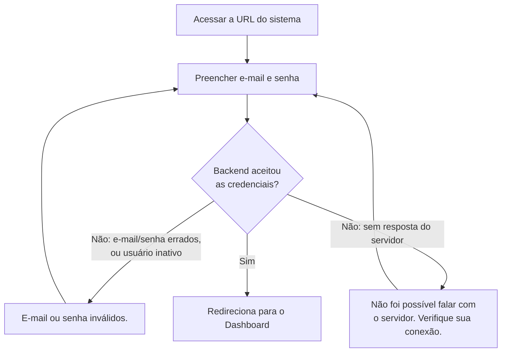

# 2. Acesso ao sistema (login)

> **Contexto:** este documento faz parte do *Manual de Utilização — Sistema Markup*, ferramenta de precificação estratégica por Markup Divisor (`PV = CP / Divisor`). Veja o índice completo em [`00-indice.md`](./00-indice.md).

1. Acesse a URL do sistema. Você verá a tela **"Boas-vindas de volta"** com o logo **Markup**.
2. Preencha:
   - **E-mail**
   - **Senha**
3. Clique em **"Entrar no sistema"**.
4. O sistema autentica contra o backend. Se algo impedir o acesso, a mensagem muda conforme a causa (ver 2.2).
5. Ao autenticar com sucesso, você é redirecionado para o **Dashboard**.

## 2.1 Sessão: token de acesso e renovação automática

O login devolve dois tokens, com políticas diferentes:

| Token | Onde fica | Validade | Propósito |
|---|---|---|---|
| **Access token** | Só em memória (RAM da aba) | 15 minutos | Autentica cada requisição; some ao fechar a aba |
| **Refresh token** | `localStorage` do navegador | 7 dias | Permite renovar o access token sem pedir senha de novo |

Na prática, isso significa:

- **Um F5 (recarregar a página) não pede senha de novo** — o sistema usa o refresh token guardado para renovar a sessão automaticamente antes de montar a tela.
- **Fechar a aba encerra o access token**, mas o refresh token continua válido por até 7 dias — reabrir o sistema nesse período renova a sessão sozinho.
- Se o refresh token expirar, for revogado, ou a renovação falhar por qualquer motivo, você é levado de volta ao login **silenciosamente** — não é tratado como erro, porque você não pediu nada ainda.
- Se a sessão cair **no meio de uma ação** (não no boot), você chega ao login com o aviso: *"Sua sessão expirou. Entre novamente."*

## 2.2 Mensagens de erro possíveis

O sistema distingue a causa da recusa em vez de mostrar um erro genérico:

| Situação | Mensagem exibida |
|---|---|
| E-mail/senha incorretos, ou usuário **inativo** (ver [`13-usuarios.md`](./13-usuarios.md)) | *"E-mail ou senha inválidos."* |
| O servidor não respondeu (rede fora, backend indisponível) | *"Não foi possível falar com o servidor. Verifique sua conexão."* |
| Chegou ao login por perda de sessão em outra tela | *"Sua sessão expirou. Entre novamente."* (aviso neutro, não erro) |

> Um backend fora do ar **nunca** aparece como "e-mail ou senha inválidos" — essa distinção existe de propósito, para o usuário não achar que errou a senha quando na verdade é a rede que está fora.

## 2.3 Saindo do sistema

O botão **Sair** (no rodapé da sidebar — ver [`03-navegacao-e-troca-de-empresa.md`](./03-navegacao-e-troca-de-empresa.md)) pede ao servidor para encerrar a sessão e apaga os tokens locais, mesmo que a chamada ao servidor falhe — a limpeza local sempre acontece, para nunca deixar alguém "preso" logado no navegador.

## 2.4 Nota de treinamento (ambiente de desenvolvimento)

> Em ambiente de **desenvolvimento** (`import.meta.env.DEV`) — nunca em produção — a tela de login tem um painel **"Preencher e-mail (dev)"** com atalhos que **só preenchem o campo de e-mail**; a senha continua sendo digitada, porque a autenticação é real. Contas de exemplo disponíveis:
>
> | Atalho | E-mail | Contexto |
> |---|---|---|
> | ADMIN global | `admin@markup.com.br` | vê as empresas cadastradas na base inteira |
> | Ana (dona) | `ana@docesdaana.com.br` | Doces da Ana + NexaTech |
> | Roberto (dono) | `roberto@metalforte.com.br` | só MetalForte |
> | Juliana (dona) | `juliana@nexatech.com.br` | só NexaTech |
> | Marcos (gerente) | `marcos@docesdaana.com.br` | menu reduzido |
> | Carla (vendedora) | `carla@docesdaana.com.br` | menu mínimo |
>
> Use essas contas para entender como o RBAC muda o que cada pessoa enxerga — ver [`14-perfis-rbac.md`](./14-perfis-rbac.md).

Depois do login, veja [`03-navegacao-e-troca-de-empresa.md`](./03-navegacao-e-troca-de-empresa.md) para entender a estrutura de navegação.
