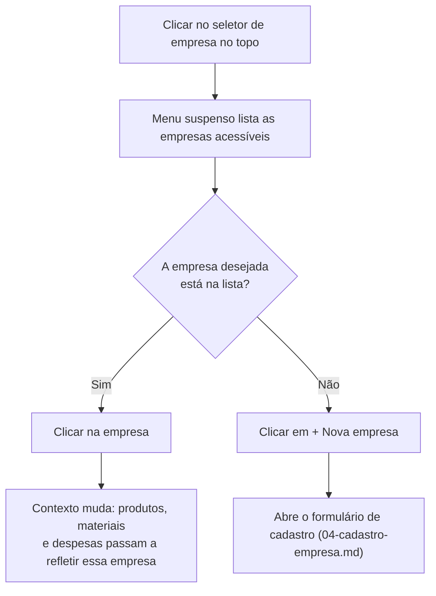

# 3. Navegação e troca de empresa

> **Contexto:** este documento faz parte do *Manual de Utilização — Sistema Markup*, ferramenta de precificação estratégica por Markup Divisor (`PV = CP / Divisor`). Veja o índice completo em [`00-indice.md`](./00-indice.md).

Depois do login (ver [`02-login.md`](./02-login.md)) você chega ao layout principal, composto por:

- **Menu lateral (sidebar)** à esquerda, agrupado em: *Principal*, *Cadastros*, *Análise*, *Configurações* e (se você for ADMIN global) *Gestão do Site*.
- **Cabeçalho** no topo, com o **seletor de empresa** (Company Switcher).
- **Rodapé da sidebar**, com seu avatar, nome, perfil atual e o botão de **Sair**.

O menu lateral só mostra os itens que o seu **perfil de acesso** permite — isso é o RBAC funcionando na prática (mais detalhes em [`14-perfis-rbac.md`](./14-perfis-rbac.md)).

## Trocando de empresa (multiempresa)

Se o seu usuário tem acesso a mais de uma empresa (por ser dono de várias, ou por ter sido convidado como colaborador em outra), use o seletor no topo:

1. Clique no card com o nome da empresa ativa (ícone do segmento + razão social + CNPJ).
2. Um menu suspenso lista todas as empresas às quais você tem acesso, com um ✓ na empresa ativa.
3. Clique em outra empresa para trocar o contexto — todos os dados das telas (produtos, materiais, despesas, etc.) passam a refletir a empresa selecionada.
4. No fim da lista há o botão **"+ Nova empresa"**, que abre o formulário de cadastro (ver [`04-cadastro-empresa.md`](./04-cadastro-empresa.md), item 4.2).

> Usuários com perfil **ADMIN** (escopo global) enxergam todas as empresas cadastradas na base, independentemente de serem donos ou não. Os demais usuários só veem as empresas que **possuem** (cadastraram) ou que foram **compartilhadas** com eles.

> **Trocar de empresa pode trocar seu perfil.** Como o perfil depende da empresa ativa (ver [`14-perfis-rbac.md`](./14-perfis-rbac.md)), se a tela em que você está não for permitida pelo perfil na nova empresa, o sistema redireciona automaticamente para o Dashboard — em vez de deixar aberta uma tela que o servidor passaria a recusar.
