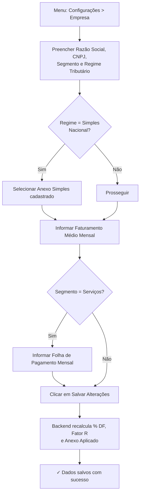
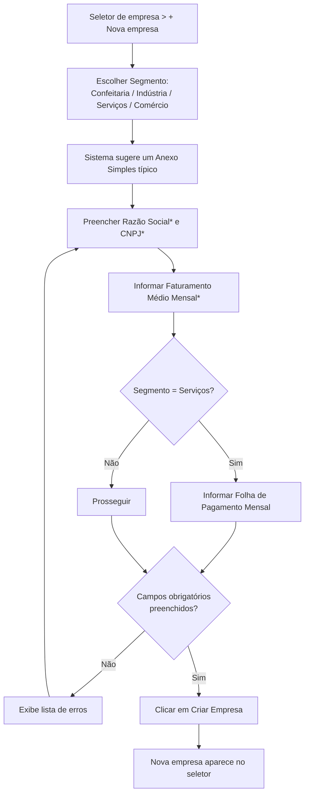

# 4. Cadastro da Empresa

> **Contexto:** este documento faz parte do *Manual de Utilização — Sistema Markup*, ferramenta de precificação estratégica por Markup Divisor (`PV = CP / Divisor`). Veja o índice completo em [`00-indice.md`](./00-indice.md).

## 4.1 Editando a empresa ativa

Menu lateral → **Configurações → Empresa** (rota `/empresa`).

Campos do formulário **"Dados Cadastrais"**:

| Campo | Descrição |
|---|---|
| **Razão Social** | Nome jurídico da empresa (obrigatório) |
| **CNPJ** | Formato `00.000.000/0000-00` |
| **Segmento de Negócio** | 🧁 Confeitaria, 🏭 Indústria, 🛠️ Serviços ou 🏬 Comércio — define os rótulos usados nas demais telas |
| **Regime Tributário** | MEI, Simples Nacional, Lucro Presumido ou Lucro Real |
| **Anexo Simples** (só aparece se o regime for Simples Nacional) | Anexo I a V — este é o **anexo cadastrado**, o ponto de partida |
| **Faturamento Médio Mensal (R$)** | Base de cálculo do rateio das Despesas Fixas — **revisar mensalmente** |
| **Folha de Pagamento Mensal (R$)** (só aparece se o segmento for Serviços) | Salários + pró-labore + encargos — numerador do **Fator R** (ver [`11-fator-r.md`](./11-fator-r.md)) |

Passos:

1. Preencha ou ajuste os campos.
2. Se o segmento escolhido for **Serviços** e o regime **Simples Nacional**, o campo de Folha de Pagamento aparece; depois de salvar, o painel de indicadores mostra o **Fator R** e o **Anexo aplicado** calculados pelo backend (Anexo III se Fator R ≥ 28%, Anexo V caso contrário).
3. Clique em **"Salvar Alterações"**.
4. Uma mensagem **"✓ Dados salvos com sucesso"** confirma a gravação.

Na coluna lateral direita, o card **"Indicadores"** mostra em tempo real:
- Faturamento Médio (por mês)
- **% Despesas Fixas** sobre o faturamento — calculado pelo backend (`percentualDespesasFixas`), fica em destaque/aviso se passar de 20%
- Segmento e sua descrição
- Regime tributário e o **Anexo Cadastrado** (se Simples Nacional)
- **Fator R** e o **Anexo Aplicado**, se a empresa for de Serviços no Simples Nacional — quando não se aplica, mostra "Não se aplica (fora do Simples de serviços)"

> ⚠ **Importante para o treinamento:** `% DF = Total de Despesas / Faturamento Médio × 100` é calculado pelo servidor, nunca pelo navegador. Se o faturamento mudar, **a precificação de todos os produtos é recalculada automaticamente**, pois o % de Despesas Fixas entra direto no divisor do markup. Detalhes do rateio em [`06-despesas-fixas.md`](./06-despesas-fixas.md).

## 4.2 Cadastrando uma nova empresa

Use quando a mesma conta de usuário administra mais de um negócio (multiempresa — ver [`03-navegacao-e-troca-de-empresa.md`](./03-navegacao-e-troca-de-empresa.md)).

1. Clique no seletor de empresa no topo → **"+ Nova empresa"**.
2. No modal **"Nova Empresa"**, escolha o **Segmento de negócio** clicando em um dos quatro cartões: 🧁 Confeitaria, 🏭 Indústria, 🛠️ Serviços ou 🏬 Comércio. O sistema já sugere um Anexo Simples típico para o segmento escolhido (Anexo II para Confeitaria/Indústria/Comércio, Anexo III para Serviços).
3. Preencha:
   - **Razão Social*** (obrigatório)
   - **CNPJ*** (obrigatório)
   - **Regime Tributário**
   - **Anexo Simples** (se aplicável)
   - **Faturamento Médio Mensal (R$)*** (obrigatório, > 0)
   - **Folha de Pagamento Mensal (R$)** (se o segmento for Serviços)
4. Se faltar um campo obrigatório, o sistema lista os erros em um quadro vermelho antes de salvar (ex.: *"Razão social é obrigatória."*, *"CNPJ é obrigatório."*, *"Informe o faturamento médio mensal."*).
5. Clique em **"Criar Empresa"**.
6. A nova empresa passa a aparecer no seletor de empresas e você já pode alternar para ela.

> **Sobre o segmento Comércio 🏬:** pensado para revenda de mercadorias (varejo/atacado) — o "custo" de cada item é o custo de aquisição, não uma composição de insumos. A ficha técnica existe para casos de kit/cesta, tipicamente com uma única linha.

> **Fator R na criação:** o simulador de Fator R **não** aparece ao vivo neste modal — ele depende de a empresa já existir no servidor. Ao escolher Serviços, o campo de Folha de Pagamento mostra apenas um aviso de que o Fator R será calculado após salvar; o valor definitivo (e o Anexo Aplicado) aparece na tela de edição da empresa (item 4.1) e no simulador dedicado ([`11-fator-r.md`](./11-fator-r.md)) depois que a empresa é criada.

> O usuário que cria a empresa se torna automaticamente o seu **dono** (`donoUsuarioId`), definido pelo servidor a partir do usuário logado. Só o dono, um colaborador explicitamente convidado, ou um ADMIN global, conseguem acessá-la depois (ver [`14-perfis-rbac.md`](./14-perfis-rbac.md), item 4).
