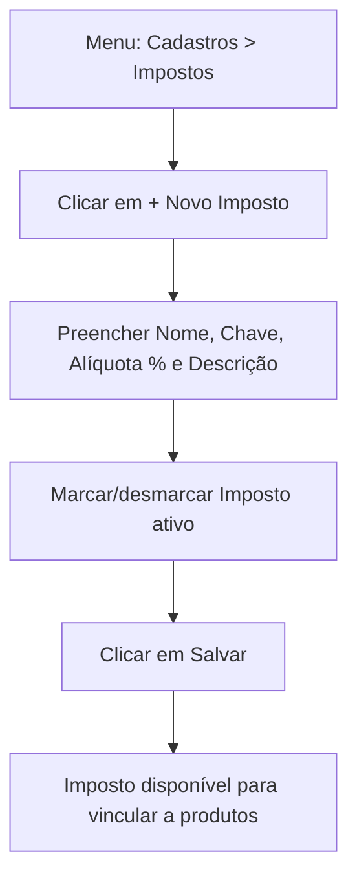

# 5. Configuração de Impostos

> **Contexto:** este documento faz parte do *Manual de Utilização — Sistema Markup*, ferramenta de precificação estratégica por Markup Divisor (`PV = CP / Divisor`). Veja o índice completo em [`00-indice.md`](./00-indice.md).

Menu lateral → **Cadastros → Impostos** (rota `/impostos`).

Esta tela cadastra as **alíquotas de impostos** que serão vinculadas aos produtos na hora de montar o preço (ver [`08-produtos-ficha-tecnica.md`](./08-produtos-ficha-tecnica.md)).

## 5.1 Consultando os impostos cadastrados

A tela exibe:
- Um **banner informativo** no topo com uma dica de enquadramento (ex.: *"Confeitaria e bolos → Anexo II (Indústria). ISS = zero para venda de mercadoria própria. Alíquota DAS = 4,5% para faturamento anual até R$ 180.000,00."*).
- Cards com cada imposto: nome, chave técnica, alíquota (%) em destaque, descrição e status (Ativo/Inativo).
- Uma tabela de referência **"Simples Nacional — Anexo II"** com as faixas de faturamento anual e suas alíquotas DAS (4,5% até R$ 180 mil; 7,8% até R$ 360 mil; 10% até R$ 720 mil; 11,2% até R$ 1,8 milhão) e o limite do MEI (R$ 81.000/ano).

## 5.2 Cadastrando um novo imposto

1. Clique em **"+ Novo Imposto"**.
2. Preencha:
   - **Nome** (ex.: "Simples Nacional — Anexo II (Faixa 1)")
   - **Chave** — identificador único, convenção `SIMPLES_NACIONAL_...` (ex.: `SIMPLES_NACIONAL_ANEXO_II_F1`)
   - **Alíquota (%)** — ex.: `4.5`
   - **Descrição**
   - Marcar/desmarcar **"Imposto ativo"**
3. Clique em **"Salvar"**.

## 5.3 Editando um imposto existente

Clique em **"Editar"** no card do imposto, ajuste os campos e salve. Alterar a alíquota de um imposto já vinculado a produtos **recalcula automaticamente** o preço de venda desses produtos (ver [`09-precificacao.md`](./09-precificacao.md)).
