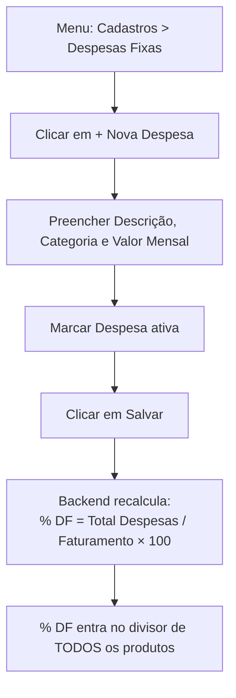

# 6. Cadastro de Despesas Fixas

> **Contexto:** este documento faz parte do *Manual de Utilização — Sistema Markup*, ferramenta de precificação estratégica por Markup Divisor (`PV = CP / Divisor`). Veja o índice completo em [`00-indice.md`](./00-indice.md).

Menu lateral → **Cadastros → Despesas Fixas** (rota `/despesas`).

As Despesas Fixas (aluguel, energia, pró-labore, contador etc.) não entram diretamente no custo do produto — elas são **rateadas proporcionalmente** sobre o faturamento médio da empresa (cadastrado em [`04-cadastro-empresa.md`](./04-cadastro-empresa.md)), virando um percentual (**% DF**) que soma no divisor do markup. O cálculo é feito inteiramente pelo backend.

```
% DF = (Soma das Despesas Fixas ativas) / (Faturamento Médio Mensal) × 100
```

## 6.1 Indicadores no topo da tela

- **Total Mensal** — soma de todas as despesas ativas.
- **% do Faturamento** — vem pronto da empresa (`percentualDespesasFixas`); fica em laranja/atenção se ultrapassar 20%.
- **Itens Ativos** — quantos itens ativos existem, do total cadastrado.

## 6.2 Cadastrando uma nova despesa

1. Clique em **"+ Nova Despesa"**.
2. Preencha:
   - **Descrição** (ex.: "Aluguel do espaço")
   - **Categoria**: Aluguel, Energia, Gás, Internet, Pró-labore, Contador ou Outro
   - **Valor Mensal (R$)**
   - Marcar **"Despesa ativa"** (só despesas ativas entram no rateio)
3. Clique em **"Salvar"**.



## 6.3 Editando, inativando ou reativando uma despesa

- Clique em **"Editar"** na linha da despesa para ajustar valor, categoria ou status.
- **Não existe exclusão.** No lugar de "Remover", o botão da linha alterna entre **"Inativar"** e **"Reativar"**:
  - Uma despesa **inativa** sai imediatamente do cálculo do % DF, mas seu registro permanece na lista (com destaque visual de inativa).
  - Isso existe porque uma despesa fixa já entrou no rateio que formou preços praticados no passado — apagá-la apagaria a explicação daqueles preços; inativar tira do cálculo futuro sem destruir o histórico.
  - Antes de confirmar, o sistema pede confirmação: *"Inativar/Reativar '[descrição]'? Despesa inativa não entra no rateio."*

> A tabela mostra, por linha, o **% do Faturamento** que aquela despesa específica representa — útil para identificar rapidamente despesas desproporcionais.
