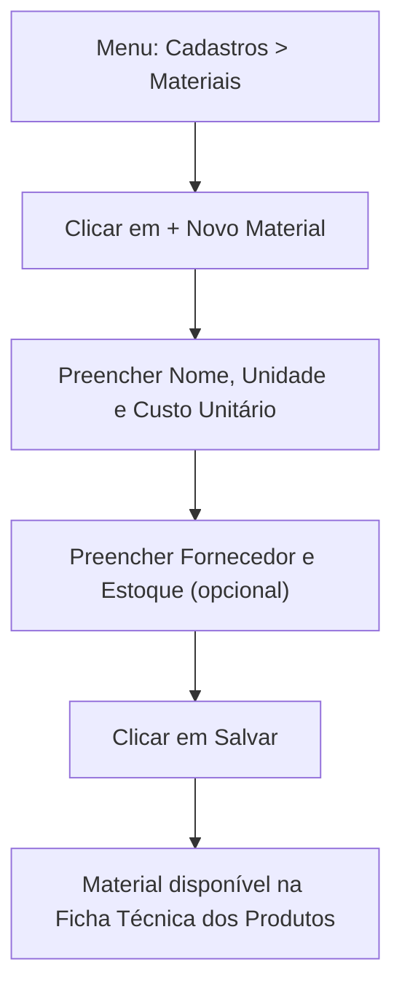

# 7. Cadastro de Materiais / Insumos

> **Contexto:** este documento faz parte do *Manual de Utilização — Sistema Markup*, ferramenta de precificação estratégica por Markup Divisor (`PV = CP / Divisor`). Veja o índice completo em [`00-indice.md`](./00-indice.md).

Menu lateral → **Cadastros → Materiais** (rota `/materiais`; o rótulo muda conforme o segmento: "Ingredientes & Insumos" na Confeitaria, "Matérias-primas & Insumos" na Indústria, "Mão de obra & Custos diretos" em Serviços).

Os materiais são os itens que compõem o **Custo Base (CP)** de cada produto (ver [`08-produtos-ficha-tecnica.md`](./08-produtos-ficha-tecnica.md)).

## 7.1 Indicadores

- Total de materiais cadastrados.
- **Estoque Baixo** — quantos itens têm estoque ≤ 5 unidades.

## 7.2 Cadastrando um novo material

1. Clique em **"+ Novo [Ingrediente/Matéria-prima/Custo direto]"**.
2. Preencha:
   - **Nome do Material** (ex.: "Farinha de trigo")
   - **Unidade**: KG, G, L, ML, UN, CX, PCT, H (hora), PC, TON, M ou M² — o sistema já sugere a unidade principal do segmento (KG para Confeitaria, UN para Indústria, H para Serviços)
   - **Custo Unitário (R$)**
   - **Fornecedor** (opcional)
   - **Estoque atual** (opcional — não se aplica bem a "hora técnica" em serviços)
3. Clique em **"Salvar"**.

> Em empresas de **Serviços**, o "material" mais comum é a **hora técnica** (unidade `H`) de cada função — ex.: "Hora — Desenvolvedor Sênior", "Hora — UX/UI Designer" — com tipo `MAO_DE_OBRA`. Custos diretos (deslocamento, licença de software, ambiente cloud) usam tipo `INSUMO`.

## 7.3 Editando um material

Clique em **"Editar"** na linha da tabela, ajuste os campos e salve. Alterar o **custo unitário** recalcula automaticamente o custo base de todos os produtos que usam esse material.

## 7.4 Busca e paginação

Use o campo de busca para filtrar por nome ou fornecedor. A lista carrega em blocos de 10 itens (rolagem infinita) — role até o fim para carregar mais.
