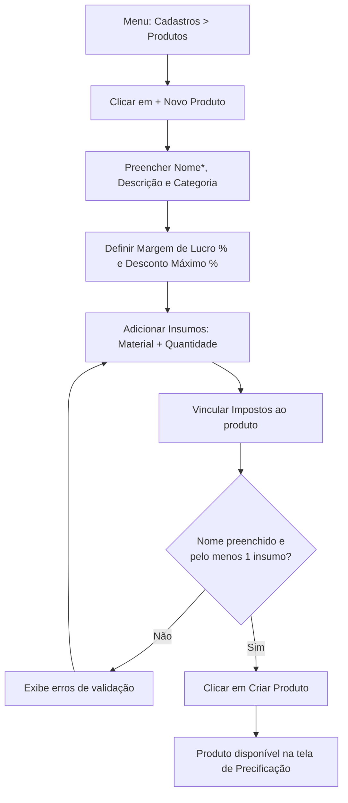

# 8. Cadastro de Produtos (Ficha Técnica)

> **Contexto:** este documento faz parte do *Manual de Utilização — Sistema Markup*, ferramenta de precificação estratégica por Markup Divisor (`PV = CP / Divisor`). Veja o índice completo em [`00-indice.md`](./00-indice.md).

Menu lateral → **Cadastros → Produtos** (rota `/produtos`).

Aqui é onde a **ficha técnica** de cada produto/serviço é montada: quais materiais ele consome (cadastrados em [`07-materiais-insumos.md`](./07-materiais-insumos.md)), em que quantidade, qual margem de lucro e qual desconto máximo o vendedor pode conceder.

## 8.1 Visualizando produtos

A tela lista os produtos em cards, com busca por nome, filtro por categoria e, em cada card: categoria, descrição, quantidade de materiais/insumos, **Margem** e **Desc. máx.** Clique em um card para abrir o detalhe — ver [`10-detalhe-produto-faixa-negociacao.md`](./10-detalhe-produto-faixa-negociacao.md).

## 8.2 Cadastrando um novo produto

1. Clique em **"+ Novo Produto"**.
2. **Dados do Produto**:
   - **Nome*** (obrigatório)
   - **Descrição**
   - **Categoria** (texto livre, ex.: "Bolos Clássicos")
   - **Produto ativo** (checkbox)
3. **Parâmetros de Precificação**:
   - **Margem de Lucro — ML (%)** — a rentabilidade líquida desejada sobre o preço de venda (dica na tela: alimentação recomenda 25%–40%)
   - **Desconto Máximo (%)** — reserva para promoções/negociação, **sem perder a margem-alvo**
4. **Ficha Técnica — Insumos**:
   - Clique em **"+ Insumo"** para adicionar uma linha.
   - Escolha o **Material**, informe a **Quantidade** utilizada — o sistema mostra a **unidade** e o **custo total** daquele item automaticamente.
   - Repita para todos os insumos da receita/composição.
   - Use o **×** para remover uma linha.
5. **Impostos Vinculados**:
   - Clique em **"+ Imposto"** para vincular um imposto cadastrado (a alíquota é copiada automaticamente, mas pode ser ajustada manualmente por produto) — ver [`05-impostos.md`](./05-impostos.md).
   - Use o **×** para desvincular.
6. Validações antes de salvar: o **Nome** é obrigatório e é preciso ter **ao menos um material** na ficha técnica — caso contrário o sistema mostra os erros em destaque e não permite salvar.
7. Clique em **"Criar Produto"**.

## 8.3 Editando um produto

Abra o produto (clique no card ou vá ao detalhe) e clique em **"Editar Produto"** — o mesmo formulário é reaberto pré-preenchido.
