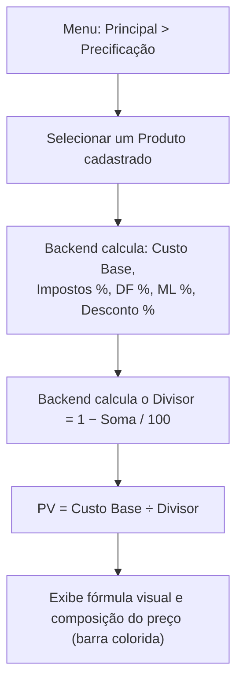
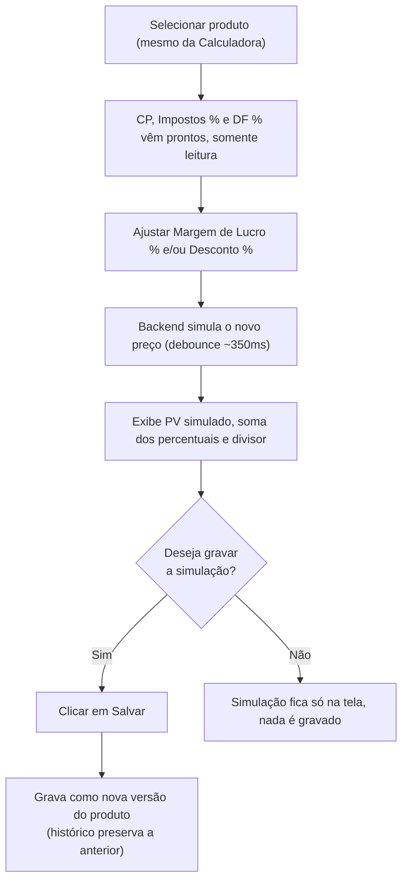

# 9. Formatação do Preço — Precificação

> **Contexto:** este documento faz parte do *Manual de Utilização — Sistema Markup*, ferramenta de precificação estratégica por Markup Divisor: `PV = CP / [1 − (Impostos% + DF% + ML% + D%)/100]` (detalhes em [`01-visao-geral-e-formula.md`](./01-visao-geral-e-formula.md)). Veja o índice completo em [`00-indice.md`](./00-indice.md).

Menu lateral → **Principal → Precificação** (rota `/precificacao`).

Esta é a tela central do sistema: mostra, produto a produto, **como o preço de venda é formado**, seguindo a fórmula do Markup por Divisor. Todo o cálculo — custo base, percentuais, divisor, preço final — é feito pelo **backend**; o front nunca refaz a conta.

## 9.1 Calculadora por Produto

1. No seletor **"Produto"**, escolha um produto já cadastrado (ver [`08-produtos-ficha-tecnica.md`](./08-produtos-ficha-tecnica.md)).
2. O sistema exibe:
   - **Preço de Venda** em destaque.
   - **Fórmula visual**: `Custo Base (CP) ÷ Divisor Markup = PV Final`, com o valor do divisor (ex.: `0,6300`) e o detalhamento `1 − soma dos percentuais`.
   - **Composição do Preço** — uma barra colorida e uma lista com cada fatia do preço:
     - Custo de Produção
     - Impostos (%)
     - Despesas Fixas
     - Desconto Máximo (reserva)
     - Lucro Líquido

Isso permite visualizar, de forma didática, **quanto de cada real cobrado vai para custo, imposto, despesa fixa, reserva de desconto e lucro**.

## 9.2 Simulação Manual — "e se eu mudasse a margem/desconto?"

Ao lado da calculadora, a **Simulação Manual** não é mais um formulário independente: ela sempre parte do **mesmo produto selecionado acima**. Custo Base, Impostos e Despesas Fixas aparecem **somente leitura**, com os valores reais do produto; só **Margem de Lucro** e **Desconto Máximo** ficam abertos para edição — é uma pergunta de "e se eu mudasse a margem/desconto deste produto?", não uma calculadora solta com números inventados.

1. Selecione um produto na Calculadora (item 9.1) — a Simulação Manual reflete os mesmos Custo Base, Impostos e Despesas Fixas.
2. Ajuste **Margem de Lucro — ML (%)** e/ou **Desconto Máximo (%)**.
3. Depois de meio segundo sem digitar (debounce), o sistema consulta o backend e atualiza:
   - A fórmula `PV = CP / Divisor`
   - O **Preço de Venda** resultante
   - A **soma dos percentuais** e o **divisor**

## 9.3 Salvando a simulação

Se os valores de Margem de Lucro ou Desconto Máximo simulados forem diferentes dos que o produto tem hoje, um botão **"Salvar"** fica disponível:

1. Clique em **"Salvar"** para gravar a margem e o desconto simulados como os novos valores do produto.
2. Essa gravação **não sobrescreve o histórico** — ela fecha a versão anterior e abre uma nova, com data de início registrada (ver o histórico de versões em [`10-detalhe-produto-faixa-negociacao.md`](./10-detalhe-produto-faixa-negociacao.md)).
3. Depois de salvar, o preço do produto na Calculadora (item 9.1) é atualizado automaticamente para refletir a nova margem/desconto.

> Trocar de produto reinicia a simulação a partir dos valores atuais do novo produto selecionado.

Para o detalhamento por produto individual, incluindo faixa de negociação, histórico de versões e geração de relatório, veja [`10-detalhe-produto-faixa-negociacao.md`](./10-detalhe-produto-faixa-negociacao.md).
