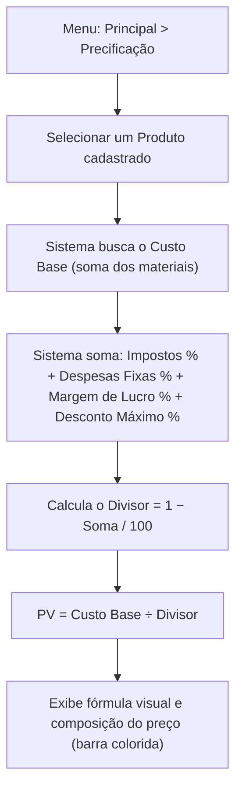
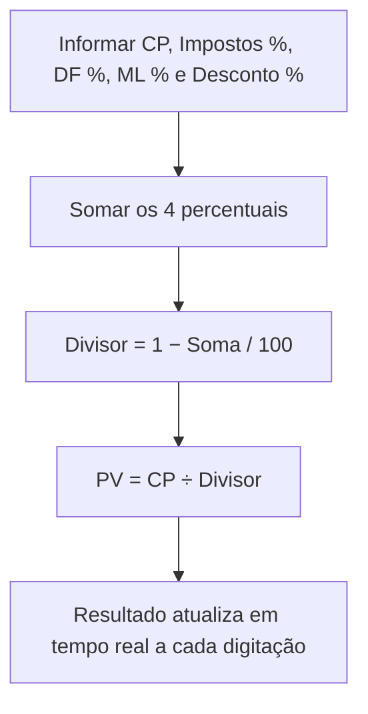

# 9. Formatação do Preço — Precificação

> **Contexto:** este documento faz parte do *Manual de Utilização — Sistema Markup*, ferramenta de precificação estratégica por Markup Divisor: `PV = CP / [1 − (Impostos% + DF% + ML% + D%)/100]` (detalhes em [`01-visao-geral-e-formula.md`](./01-visao-geral-e-formula.md)). Veja o índice completo em [`00-indice.md`](./00-indice.md).

Menu lateral → **Principal → Precificação** (rota `/precificacao`).

Esta é a tela central do sistema: mostra, produto a produto, **como o preço de venda é formado**, seguindo a fórmula do Markup por Divisor.

## 9.1 Calculadora por Produto

1. No seletor **"Produto"**, escolha um produto já cadastrado (ver [`08-produtos-ficha-tecnica.md`](./08-produtos-ficha-tecnica.md)).
2. O sistema exibe:
   - **Preço de Venda** em destaque.
   - **Fórmula visual**: `Custo Base (CP) ÷ Divisor Markup = PV Final`, com o valor do divisor (ex.: `0,6300`) e o detalhamento `1 − soma dos percentuais`.
   - **Composição do Preço** — uma barra colorida e uma lista com cada fatia do preço:
     - Custo de Produção
     - Impostos (%)
     - Despesas Fixas
     - Desconto Máximo (reserva)
     - Lucro Líquido

Isso permite visualizar, de forma didática, **quanto de cada real cobrado vai para custo, imposto, despesa fixa, reserva de desconto e lucro**.

## 9.2 Simulação Manual

Ao lado da calculadora por produto, a **Simulação Manual** permite testar a fórmula "no braço", sem precisar de um produto cadastrado — ideal para treinamento e explicações rápidas:

1. Informe:
   - **Custo Base — CP (R$)**
   - **Impostos (%)**
   - **Despesas Fixas — DF (%)**
   - **Margem de Lucro — ML (%)**
   - **Desconto Máximo (%)**
2. O sistema calcula em tempo real:
   - A fórmula `PV = CP / Divisor`
   - O **Preço de Venda** resultante
   - A **soma dos percentuais** e o **divisor**

> **Exemplo didático (valores padrão da simulação):** CP = R$ 12,00, Impostos = 4,5%, DF = 15%, ML = 30%, Desconto = 5%. Soma = 54,5% → Divisor = 1 − 0,545 = 0,455 → PV = 12 / 0,455 ≈ **R$ 26,37**.

Para o detalhamento por produto individual, incluindo faixa de negociação e geração de PDF, veja [`10-detalhe-produto-faixa-negociacao.md`](./10-detalhe-produto-faixa-negociacao.md).
