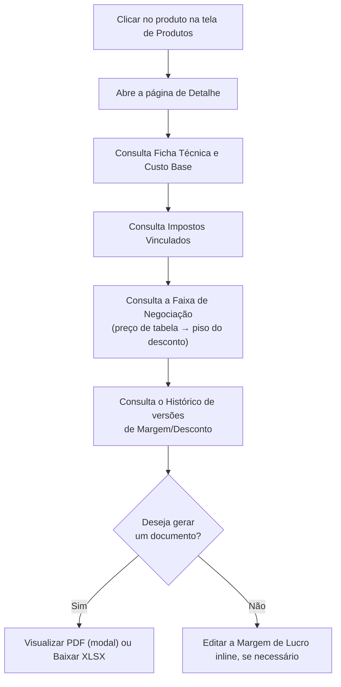
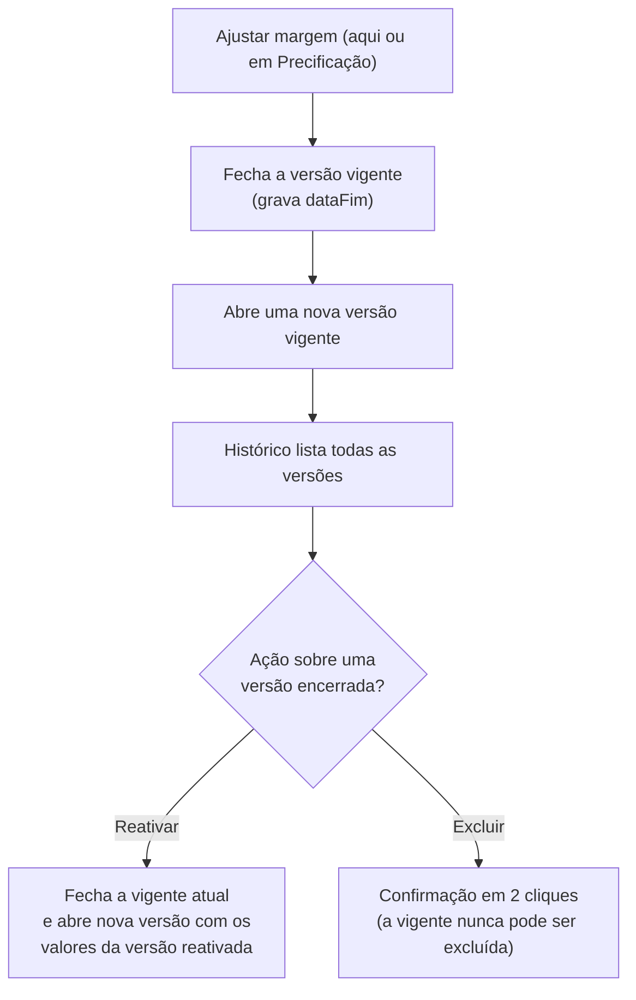

# 10. Detalhe do Produto, Faixa de Negociação, Histórico e Relatório

> **Contexto:** este documento faz parte do *Manual de Utilização — Sistema Markup*, ferramenta de precificação estratégica por Markup Divisor (`PV = CP / Divisor`). Veja o índice completo em [`00-indice.md`](./00-indice.md).

Clique em qualquer produto na tela de Produtos (ver [`08-produtos-ficha-tecnica.md`](./08-produtos-ficha-tecnica.md)) ou em "Ver ficha técnica →" para abrir a **página de detalhe** (rota `/produtos/:id`).

Esta página reúne tudo sobre o produto:

## 10.1 Ficha Técnica

Tabela com cada material usado, quantidade, unidade, custo unitário e custo total, terminando na linha **"Custo Base Total (CP)"**.

## 10.2 Impostos Vinculados

Lista os impostos aplicados ao produto e suas alíquotas (cadastrados em [`05-impostos.md`](./05-impostos.md)).

## 10.3 Faixa de Negociação

Um card mostra, do **preço de tabela** (desconto 0%) até o **piso** (desconto máximo cadastrado), quanto o vendedor pode conceder de desconto **sem tocar na margem de lucro-alvo** — porque o desconto máximo já foi reservado no divisor do markup. A faixa mostra "degraus" intermediários com o preço praticado, o lucro correspondente e a margem efetiva em cada ponto.

## 10.4 Parâmetros de Precificação (coluna direita)

- **Margem de Lucro (ML)** — pode ser editada rapidamente clicando em **"Editar"** ao lado do valor, sem precisar abrir o formulário completo. Esse ajuste grava uma **mutation própria** (não reenvia a ficha técnica inteira) e **abre uma nova versão** no histórico (item 10.6), preservando a anterior.
- **Desconto (mín. → máx.)** — mostra o piso de preço, abaixo do qual a venda sai do lucro.
- **Impostos (total)** e **Despesas Fixas (rateio)**.
- Um bloco de resumo com a fórmula `PV = Custo Base / Divisor`, o **Preço de Venda** e o detalhamento (custo recuperado, impostos, despesas fixas, desconto reservado e lucro líquido).

## 10.5 Gerando a Ficha Técnica (PDF ou XLSX)

1. Clique em **"📄 Visualizar PDF"** para abrir uma **pré-visualização em modal** antes de decidir baixar — o documento é gerado pelo módulo de relatórios do backend (JasperReports).
2. Dentro da modal, o botão de baixar salva o mesmo PDF já pré-visualizado, sem nova requisição ao servidor.
3. Clique em **"📊 Baixar XLSX"** para obter a planilha diretamente, sem pré-visualização — vai direto para "Salvar Como" do navegador.
4. Se houver falha na geração, uma mensagem de erro aparece na tela.

> A página também tem um layout específico para **impressão** (cabeçalho com razão social e CNPJ da empresa, data de emissão), acionado quando o navegador imprime a página.

## 10.6 Histórico de Margem — versionamento

Todo ajuste de margem/desconto do produto (feito aqui ou em [`09-precificacao.md`](./09-precificacao.md), item 9.3) **não sobrescreve** o valor anterior — ele fecha a versão vigente e abre uma nova. O card **"Histórico de Margem"** lista todas as versões, da mais recente para a mais antiga:

- Cada linha mostra a margem, o desconto, a data de início e a data de fim (ou **"vigente"**, com badge verde, se ainda não foi substituída).
- **A versão vigente nunca pode ser apagada** — o servidor sempre garante que existe uma versão aberta.
- Para uma versão **encerrada** (não vigente), duas ações ficam disponíveis:
  - **"Reativar"** — não volta no tempo: fecha a versão vigente atual e abre uma nova versão com os valores da versão reativada. Preço, produto e histórico são recarregados na sequência.
  - **"Excluir"** — pede confirmação em dois cliques (o botão vira **"Confirmar exclusão?"** por alguns segundos antes de reverter) para que uma exclusão de verdade nunca saia de um toque errado.

