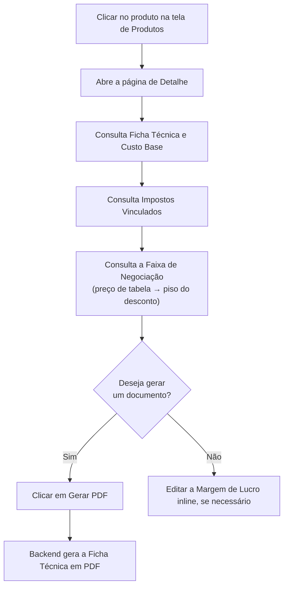

# 10. Detalhe do Produto, Faixa de Negociação e PDF

> **Contexto:** este documento faz parte do *Manual de Utilização — Sistema Markup*, ferramenta de precificação estratégica por Markup Divisor (`PV = CP / Divisor`). Veja o índice completo em [`00-indice.md`](./00-indice.md).

Clique em qualquer produto na tela de Produtos (ver [`08-produtos-ficha-tecnica.md`](./08-produtos-ficha-tecnica.md)) ou em "Ver ficha técnica →" para abrir a **página de detalhe** (rota `/produtos/:id`).

Esta página reúne tudo sobre o produto:

## 10.1 Ficha Técnica

Tabela com cada material usado, quantidade, unidade, custo unitário e custo total, terminando na linha **"Custo Base Total (CP)"**.

## 10.2 Impostos Vinculados

Lista os impostos aplicados ao produto e suas alíquotas (cadastrados em [`05-impostos.md`](./05-impostos.md)).

## 10.3 Faixa de Negociação

Um card mostra, do **preço de tabela** (desconto 0%) até o **piso** (desconto máximo cadastrado), quanto o vendedor pode conceder de desconto **sem tocar na margem de lucro-alvo** — porque o desconto máximo já foi reservado no divisor do markup. A faixa mostra "degraus" intermediários com o preço praticado, o lucro correspondente e a margem efetiva em cada ponto.

## 10.4 Parâmetros de Precificação (coluna direita)

- **Margem de Lucro (ML)** — pode ser editada rapidamente clicando em **"Editar"** ao lado do valor, sem precisar abrir o formulário completo.
- **Desconto (mín. → máx.)** — mostra o piso de preço, abaixo do qual a venda sai do lucro.
- **Impostos (total)** e **Despesas Fixas (rateio)**.
- Um bloco de resumo com a fórmula `PV = Custo Base / Divisor`, o **Preço de Venda** e o detalhamento (custo recuperado, impostos, despesas fixas, desconto reservado e lucro líquido).

## 10.5 Gerando o PDF da Ficha Técnica

1. Clique em **"Gerar PDF"** no topo da página.
2. O sistema solicita ao backend a geração do relatório **"Ficha Técnica do Produto"**.
3. Se houver falha na geração, uma mensagem de erro aparece na tela.

> A página também tem um layout específico para **impressão** (cabeçalho com razão social e CNPJ da empresa, data de emissão), acionado quando o navegador imprime a página.
