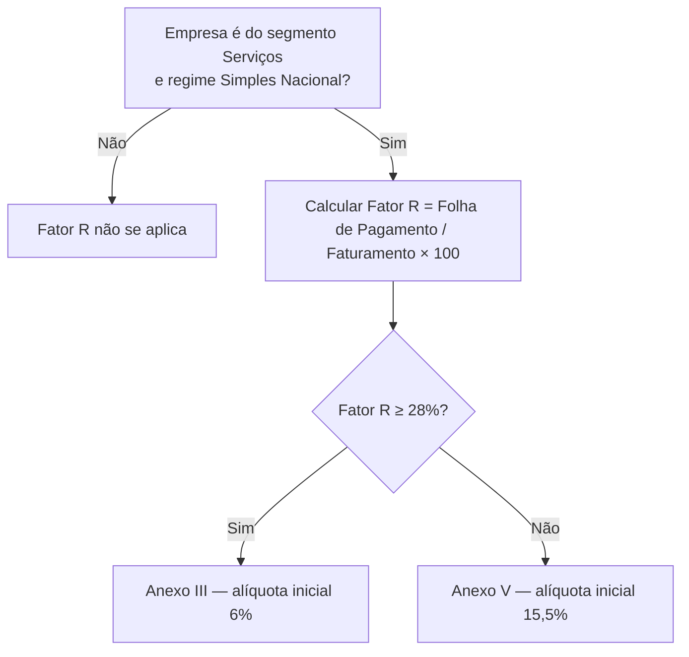

# 11. Fator R (empresas de Serviços)

> **Contexto:** este documento faz parte do *Manual de Utilização — Sistema Markup*, ferramenta de precificação estratégica por Markup Divisor (`PV = CP / Divisor`). Veja o índice completo em [`00-indice.md`](./00-indice.md).

Menu lateral → **Análise → Fator R** (rota `/fator-r`) — visível para qualquer perfil com permissão `EMPRESA_READ` (ver [`14-perfis-rbac.md`](./14-perfis-rbac.md)).

O **Fator R** só se aplica a empresas do segmento **Serviços** no **Simples Nacional** (cadastro em [`04-cadastro-empresa.md`](./04-cadastro-empresa.md)), e decide qual Anexo tributário será usado:

```
Fator R (%) = Folha de Pagamento Mensal / Faturamento Médio Mensal × 100
```

- **Fator R ≥ 28%** → tributa pelo **Anexo III** (alíquota inicial de 6%) — mais vantajoso.
- **Fator R < 28%** → tributa pelo **Anexo V** (alíquota inicial de 15,5%).



## 11.1 Simulador de Fator R

Se a empresa ativa é de Serviços, a tela mostra:

1. O **Faturamento médio mensal** (fixo, vem do cadastro da empresa).
2. Um **slider (controle deslizante)** de **Folha de pagamento mensal** — arraste para simular diferentes valores de folha e ver o Fator R e o Anexo mudarem em tempo real.
3. Um **medidor visual (gauge)** com o percentual do Fator R e uma linha marcando o limite de 28%.
4. Uma dica dizendo exatamente **quanto a folha precisaria aumentar** para migrar ao Anexo III, quando o Fator R está abaixo do limite.

## 11.2 Impacto no preço

Um card comparativo mostra, para o mesmo serviço, **quanto o preço de venda mudaria** se a empresa estivesse no Anexo III versus no Anexo V, evidenciando o impacto financeiro direto de manter (ou não) a folha de pagamento acima de 28% do faturamento.

## 11.3 Empresas de serviços (comparativo)

Uma tabela final lista todas as empresas de Serviços da base, com faturamento, folha, Fator R calculado e o Anexo resultante — útil para comparar o cenário entre diferentes empresas/filiais.

> Se a empresa ativa **não** for do segmento Serviços, a tela exibe um aviso explicando que o Fator R não se aplica e direciona para trocar de empresa ou consultar o comparativo.
