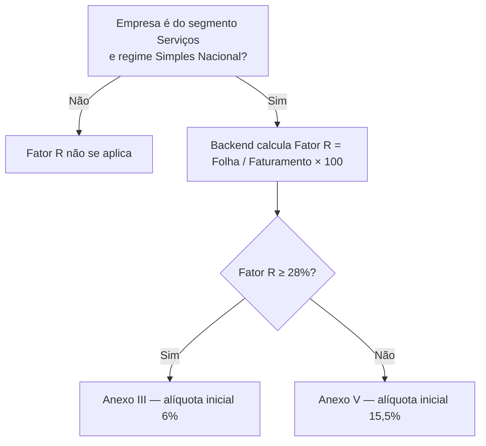

# 11. Fator R (empresas de Serviços)

> **Contexto:** este documento faz parte do *Manual de Utilização — Sistema Markup*, ferramenta de precificação estratégica por Markup Divisor (`PV = CP / Divisor`). Veja o índice completo em [`00-indice.md`](./00-indice.md).

Menu lateral → **Análise → Fator R** (rota `/fator-r`) — visível para qualquer perfil com permissão `EMPRESA_READ` (ver [`14-perfis-rbac.md`](./14-perfis-rbac.md)).

O **Fator R** só se aplica a empresas do segmento **Serviços**, no regime **Simples Nacional** (cadastro em [`04-cadastro-empresa.md`](./04-cadastro-empresa.md)), e decide qual Anexo tributário será usado:

```
Fator R (%) = Folha de Pagamento Mensal / Faturamento Médio Mensal × 100
```

- **Fator R ≥ 28%** → tributa pelo **Anexo III** (alíquota inicial de 6%) — mais vantajoso.
- **Fator R < 28%** → tributa pelo **Anexo V** (alíquota inicial de 15,5%).

Todo o cálculo é feito pelo **backend** — o front nunca reimplementa a fórmula localmente.



Se a empresa ativa **não** for do segmento Serviços no Simples Nacional, a tela exibe um aviso explicando que o Fator R não se aplica a ela e direciona para trocar de empresa ou consultar o comparativo (item 11.3).

## 11.1 Simulador de Fator R

Se a empresa ativa é de Serviços no Simples Nacional, a tela mostra:

1. O **Faturamento médio mensal** (fixo, vem do cadastro da empresa).
2. Um campo de **Folha de pagamento mensal**, com duas formas de ajustar o mesmo valor:
   - Um **slider (controle deslizante)** — o limite máximo do slider se ajusta automaticamente conforme o valor digitado, para nunca ficar curto.
   - Um **campo de texto com máscara monetária** (padrão de app bancário: dígitos preenchem da direita para a esquerda).
3. A cada mudança, depois de uma pequena pausa (debounce de ~350ms), o sistema consulta o backend (`simularFatorR`) e atualiza:
   - Um **medidor visual (gauge)** com o percentual do Fator R e uma linha marcando o limite de 28%.
   - O **Anexo resultante** (III ou V), com badge colorida (verde para Anexo III, laranja para Anexo V).

> A simulação de Fator R é **stateless** — nada é gravado ao arrastar o slider. Ela mostra "e se a folha fosse este valor?", sem alterar o cadastro da empresa.

## 11.2 Impacto no preço

Um segundo card compara, para **um produto real da empresa** (escolhido em um seletor), quanto o preço de venda mudaria se a empresa estivesse tributada pelo Anexo III versus pelo Anexo V — usando as alíquotas de 1ª faixa do Simples (6% e 15,5%, respectivamente).

1. Escolha um produto ativo no seletor do card **"Impacto no preço"**.
2. O sistema consulta o backend (`simularImpactoAnexo`) e mostra, lado a lado, o preço de venda do mesmo produto em cada cenário, com a diferença em reais e em percentual.

> Esta comparação é **didática**: usa as alíquotas nominais de 1ª faixa de cada anexo, não necessariamente os impostos cadastrados no produto (ver [`05-impostos.md`](./05-impostos.md)), que são o dado usado no preço oficial exibido em [`09-precificacao.md`](./09-precificacao.md).

## 11.3 Empresas de serviços (comparativo)

Uma tabela final lista todas as empresas de **Serviços no Simples Nacional** às quais o usuário tem acesso, com faturamento, folha, Fator R calculado e o Anexo resultante — útil para comparar o cenário entre diferentes empresas/filiais sem precisar trocar de empresa ativa a cada vez.
