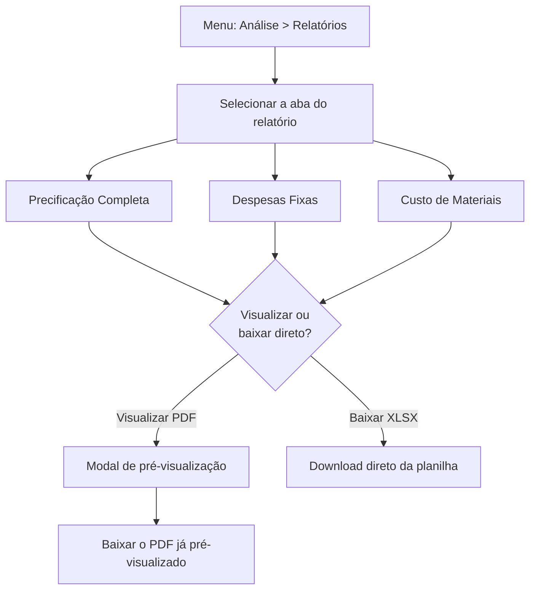

# 12. Relatórios

> **Contexto:** este documento faz parte do *Manual de Utilização — Sistema Markup*, ferramenta de precificação estratégica por Markup Divisor (`PV = CP / Divisor`). Veja o índice completo em [`00-indice.md`](./00-indice.md).

Menu lateral → **Análise → Relatórios** (rota `/relatorios`).

Três relatórios estão disponíveis por abas:

1. **Precificação Completa** — tabela com todos os produtos e, para cada um: custo base, % impostos, % DF, % ML, % desconto, divisor e preço de venda/lucro líquido calculados (ver [`09-precificacao.md`](./09-precificacao.md)).
2. **Despesas Fixas** — lista de despesas com valor, % do faturamento e status, mais o total geral (ver [`06-despesas-fixas.md`](./06-despesas-fixas.md)).
3. **Custo de Materiais** — lista de materiais com custo unitário, fornecedor, estoque e um alerta visual (**"Baixo"**) quando o estoque estiver ≤ 5 unidades (ver [`07-materiais-insumos.md`](./07-materiais-insumos.md)).

Todos os relatórios são documentos gerados pelo **backend** (JasperReports) — o front só pede, pré-visualiza e baixa.

## 12.1 Visualizar antes de baixar

Clique em **"📄 Visualizar PDF"** no canto superior direito para abrir uma **pré-visualização em modal** do relatório correspondente à aba selecionada, antes de decidir baixar. Dentro da modal, um botão baixa o mesmo PDF já pré-visualizado, sem fazer uma nova requisição ao servidor.

## 12.2 Baixar direto em XLSX

Clique em **"📊 Baixar XLSX"** para obter a planilha diretamente — sem pré-visualização — pronta para abrir em Excel/Sheets ou continuar a análise fora do sistema.

Se houver falha na geração, uma mensagem de erro aparece acima da tabela.
