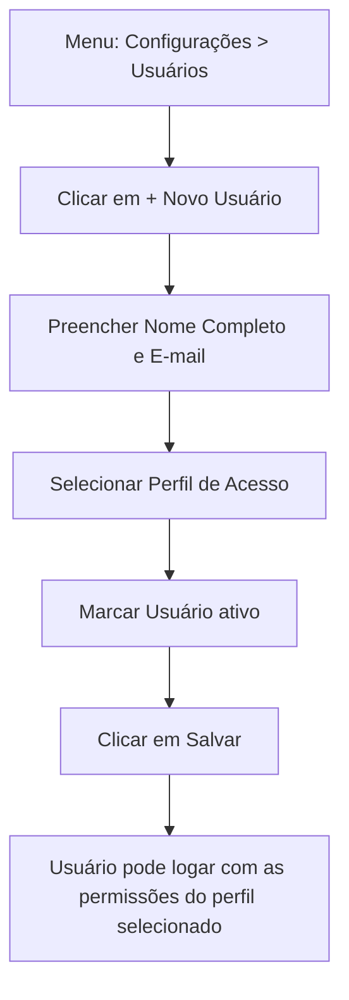

# 13. Configuração de Usuários

> **Contexto:** este documento faz parte do *Manual de Utilização — Sistema Markup*, ferramenta de precificação estratégica por Markup Divisor (`PV = CP / Divisor`). Veja o índice completo em [`00-indice.md`](./00-indice.md).

Menu lateral → **Configurações → Usuários** (rota `/usuarios`) — exige permissão `USUARIO_READ` (ver [`14-perfis-rbac.md`](./14-perfis-rbac.md)).

## 13.1 Visualizando usuários

Cada usuário aparece em um card com avatar (iniciais do nome), nome, e-mail, os perfis vinculados (badges verdes) e o status (Ativo/Inativo).

Abaixo, a tabela **"Visão Geral — Permissões por Perfil"** resume, por perfil: quantos usuários o utilizam, as primeiras permissões concedidas e a descrição do perfil.

## 13.2 Cadastrando um novo usuário

1. Clique em **"+ Novo Usuário"**.
2. Preencha:
   - **Nome Completo**
   - **E-mail**
   - **Perfil de Acesso** — selecione um dos perfis cadastrados (ver [`14-perfis-rbac.md`](./14-perfis-rbac.md))
   - **Usuário ativo** (checkbox)
3. Clique em **"Salvar"**.

## 13.3 Editando um usuário

Clique em **"Editar"** no card do usuário para trocar nome, e-mail, perfil vinculado ou status (ativar/desativar).

> Desativar um usuário **bloqueia o login** dele imediatamente (mensagem *"E-mail não encontrado ou usuário inativo"* na tela de login — ver [`02-login.md`](./02-login.md)), sem excluir o histórico de dados associado a ele.
