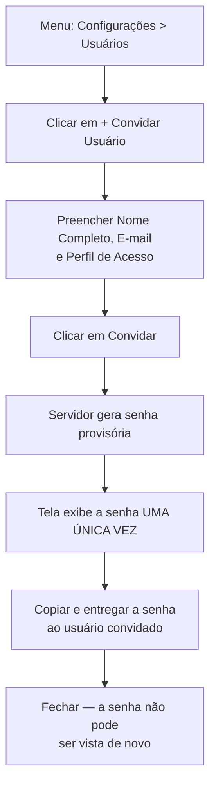

# 13. Configuração de Usuários

> **Contexto:** este documento faz parte do *Manual de Utilização — Sistema Markup*, ferramenta de precificação estratégica por Markup Divisor (`PV = CP / Divisor`). Veja o índice completo em [`00-indice.md`](./00-indice.md).

Menu lateral → **Configurações → Usuários** (rota `/usuarios`) — exige permissão `USUARIO_READ` (ver [`14-perfis-rbac.md`](./14-perfis-rbac.md)).

## 13.1 Visualizando usuários

Cada usuário aparece em um card com avatar (iniciais do nome), nome, e-mail, os perfis vinculados (badges verdes) e o status (Ativo/Inativo). A lista mostra apenas usuários com vínculo na **empresa ativa** — ver [`03-navegacao-e-troca-de-empresa.md`](./03-navegacao-e-troca-de-empresa.md).

Abaixo, a tabela **"Visão Geral — Permissões por Perfil"** resume, por perfil: quantos usuários o utilizam, as primeiras permissões concedidas e a descrição do perfil.

## 13.2 Convidando um novo usuário

> **Não existe cadastro direto de usuário.** O acesso nasce por **convite** — o sistema não tem uma operação para criar um usuário já pronto com senha definida.

1. Clique em **"+ Convidar Usuário"**.
2. Preencha:
   - **Nome Completo**
   - **E-mail**
   - **Perfil de Acesso** — selecione um dos perfis cadastrados (ver [`14-perfis-rbac.md`](./14-perfis-rbac.md))
3. Clique em **"Convidar"**.
4. O sistema gera uma **senha provisória** e a exibe **uma única vez**, com um aviso destacado: *"Esta senha aparece uma única vez. Ela não é recuperável depois — copie e entregue a [nome] agora."*
5. Use o botão **"Copiar"** para copiar a senha para a área de transferência, e entregue-a à pessoa convidada por um canal seguro (a tela não reenvia nem reexibe a senha depois de fechada).
6. Clique em **"Concluir"** para fechar a modal.

> O convite feito aqui vincula o usuário à **empresa ativa** no momento. Para convidar alguém com **escopo global** (sem empresa, como um ADMIN de suporte), essa ação fica no módulo Gestão do Site — ver [`15-gestao-do-site.md`](./15-gestao-do-site.md), item 15.3.

## 13.3 O que não é possível fazer nesta tela

- **Não há edição** de nome, e-mail ou perfil de um usuário já convidado.
- **Não há ativação/desativação** de usuário nesta tela — essa ação existe apenas no módulo **Gestão do Site**, restrito a quem tem escopo global (ADMIN) — ver [`15-gestao-do-site.md`](./15-gestao-do-site.md).

> Um usuário **inativo** tem o login bloqueado imediatamente (mensagem *"E-mail ou senha inválidos."* na tela de login — ver [`02-login.md`](./02-login.md)), sem excluir o histórico de dados associado a ele.
