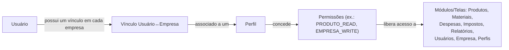
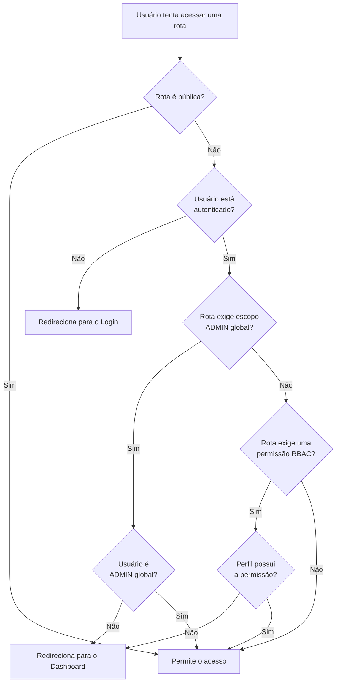

# 14. Perfis de Acesso e Permissões (RBAC)

> **Contexto:** este documento faz parte do *Manual de Utilização — Sistema Markup*, ferramenta de precificação estratégica por Markup Divisor (`PV = CP / Divisor`). Veja o índice completo em [`00-indice.md`](./00-indice.md).

Menu lateral → **Configurações → Perfis & RBAC** (rota `/perfis`) — exige permissão `PERFIL_READ`.

O sistema usa **RBAC** (controle de acesso baseado em papéis): cada usuário (ver [`13-usuarios.md`](./13-usuarios.md)) tem um **perfil**, e cada perfil concentra um conjunto de **permissões** (chaves como `PRODUTO_READ`, `PRODUTO_WRITE`, `EMPRESA_WRITE` etc.), organizadas por módulo (Produtos, Materiais, Despesas, Impostos, Relatórios, Usuários, Empresa, Perfis).

## 14.1 Perfis padrão do sistema

| Perfil | Escopo | O que pode fazer |
|---|---|---|
| **ADMIN** | Global (todas as empresas) | Acesso total — é o único perfil de **suporte/gestão da plataforma**, usado pelo módulo *Gestão do Site* (ver [`15-gestao-do-site.md`](./15-gestao-do-site.md)) |
| **PROPRIETARIO** | Por empresa | Acesso total, mas restrito às empresas que possui ou que foram compartilhadas com ele |
| **GERENTE** | Por empresa | Leitura e edição de Produtos e Materiais, leitura de Despesas e Relatórios, leitura da Empresa |
| **VENDEDOR** | Por empresa | Apenas leitura de Produtos e Relatórios — menu mínimo |
| **CONTADOR** | Por empresa | Impostos (leitura/edição), Despesas (leitura/edição), Relatórios e leitura da Empresa |

## 14.2 Consultando a Matriz de Permissões

A tela exibe:
- **Cards de perfil**, cada um com a contagem de permissões e "chips" coloridos indicando permissões de leitura (`_READ`, em verde-claro) e de escrita (`_WRITE`, em amarelo).
- Uma **Matriz de Permissões RBAC** completa: linhas agrupadas por módulo, colunas por perfil, com ✓ indicando que aquele perfil possui aquela permissão específica.

Use a matriz para responder perguntas como *"o Vendedor consegue editar despesas?"* rapidamente (procure a linha `DESPESA_WRITE`, coluna VENDEDOR).

## 14.3 Como as permissões afetam a navegação

- Cada item do menu lateral está associado a uma permissão (`meta.permissao` da rota). Se o perfil do usuário não tiver aquela permissão, **o item nem aparece no menu**, e se o usuário tentar acessar a URL diretamente, é redirecionado de volta ao Dashboard.
- Isso é apenas uma conveniência de interface — **a autoridade final é sempre o backend**, que valida a mesma permissão em cada operação.

## 14.4 Multiempresa e compartilhamento

Um usuário pode ter **múltiplos vínculos** — ele pode ser dono de uma empresa e, ao mesmo tempo, ter sido **convidado/compartilhado** em outra empresa com um perfil diferente (por exemplo, ser Proprietário na própria confeitaria e atuar como Contador em uma empresa de terceiros). Cada vínculo é independente e define o perfil (e portanto as permissões) daquele usuário **naquela empresa específica**. Ver também [`03-navegacao-e-troca-de-empresa.md`](./03-navegacao-e-troca-de-empresa.md).
