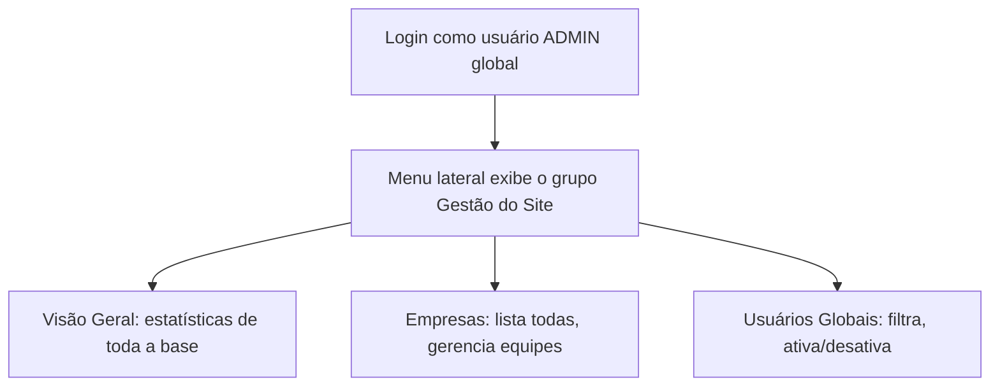

# 15. Gestão do Site (módulo ADMIN global)

> **Contexto:** este documento faz parte do *Manual de Utilização — Sistema Markup*, ferramenta de precificação estratégica por Markup Divisor (`PV = CP / Divisor`). Veja o índice completo em [`00-indice.md`](./00-indice.md).

Visível apenas para usuários com perfil de **escopo global** (ADMIN — ver [`14-perfis-rbac.md`](./14-perfis-rbac.md)) — aparece como o grupo **"Gestão do Site"** no fim do menu lateral, com identidade visual própria (ícone ⚙ e cores neutras).

> Diferente das demais seções, o acesso aqui **não depende de uma permissão RBAC específica**, e sim do **escopo global** do perfil — mesmo um usuário PROPRIETARIO (que tem todas as permissões dentro das suas empresas) não enxerga este módulo.

## 15.1 Visão Geral (rota `/admin`)

Painel de entrada com:
- Estatísticas gerais: empresas cadastradas, usuários na base (ativos/inativos), vínculos usuário↔empresa e faturamento médio somado de toda a base.
- **Empresas por segmento** — quantas empresas existem em cada segmento.
- **Perfis em uso** — quantos usuários usam cada perfil e se o escopo é global ou por empresa.
- **Maiores equipes** — as 5 empresas com mais usuários vinculados, com atalho para gerenciá-las.

## 15.2 Empresas (rota `/admin/empresas`)

Lista **todas** as empresas da base (independente de dono), permitindo abrir o detalhe de cada uma para gerenciar sua equipe/vínculos.

## 15.3 Usuários Globais (rota `/admin/usuarios`)

Lista **todos** os usuários da base com filtros por nome/e-mail, empresa, perfil e status. Para cada usuário mostra:
- Se o escopo é **global** (ADMIN) ou **por empresa**.
- Todos os **acessos** (empresa + perfil, com indicação de "dono" quando aplicável).
- Ação de **Ativar/Desativar** o usuário diretamente na lista.
