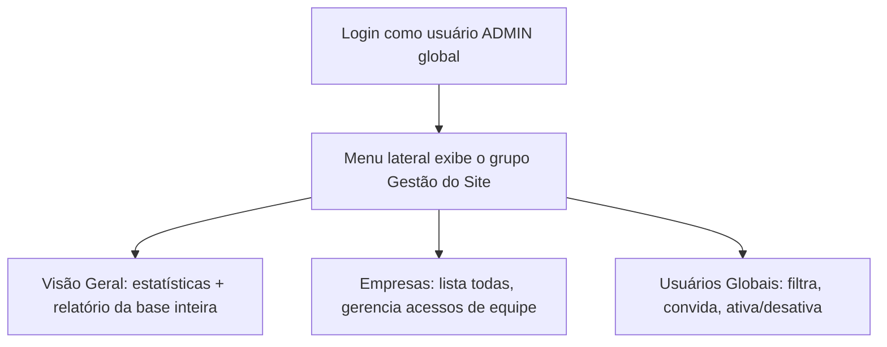
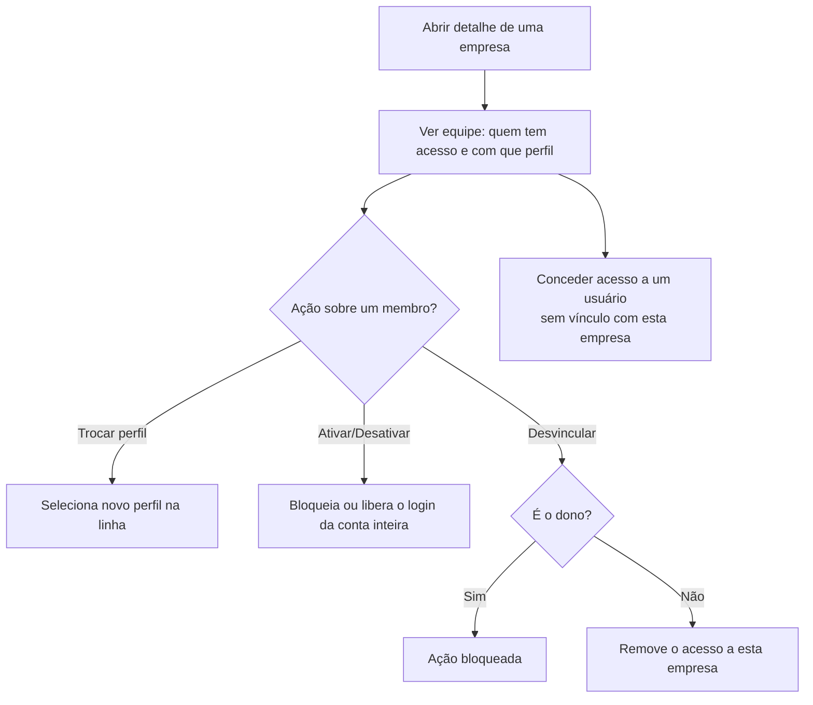
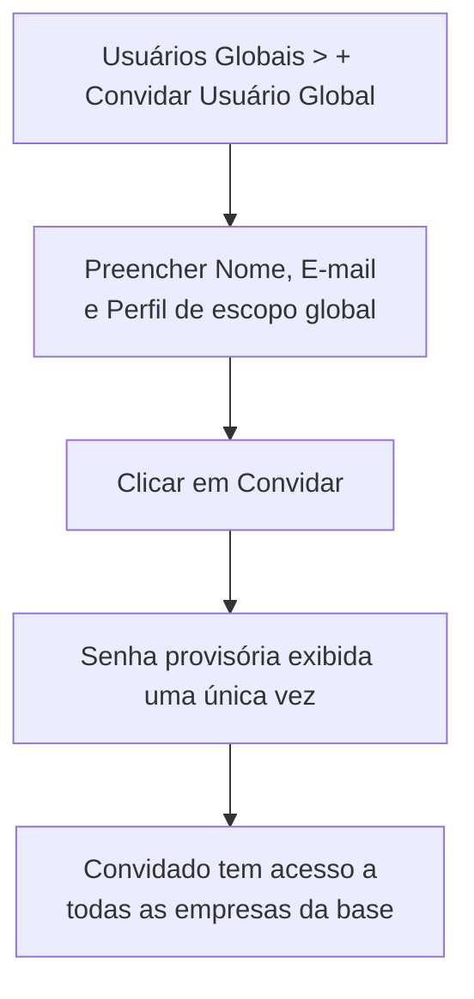

# 15. Gestão do Site (módulo ADMIN global)

> **Contexto:** este documento faz parte do *Manual de Utilização — Sistema Markup*, ferramenta de precificação estratégica por Markup Divisor (`PV = CP / Divisor`). Veja o índice completo em [`00-indice.md`](./00-indice.md).

Visível apenas para usuários com perfil de **escopo global** (ADMIN — ver [`14-perfis-rbac.md`](./14-perfis-rbac.md)) — aparece como o grupo **"Gestão do Site"** no fim do menu lateral, com identidade visual própria (ícone ⚙ e cores neutras).

> Diferente das demais seções, o acesso aqui **não depende de uma permissão RBAC específica**, e sim do **escopo global** do perfil — mesmo um usuário PROPRIETARIO (que tem todas as permissões dentro das suas empresas) não enxerga este módulo.

## 15.1 Visão Geral (rota `/admin`)

Painel de entrada com:
- Estatísticas gerais: empresas cadastradas, usuários na base (ativos/inativos), vínculos usuário↔empresa e faturamento médio somado de toda a base.
- **Empresas por segmento** — quantas empresas existem em cada segmento (Confeitaria, Indústria, Serviços, Comércio).
- **Perfis em uso** — quantos usuários usam cada perfil e se o escopo é global ou por empresa.
- **Maiores equipes** — as 5 empresas com mais usuários vinculados, com atalho para gerenciá-las.
- **Relatório da base inteira** — botões **"📄 Visualizar PDF"** e **"📊 Baixar XLSX"** geram um relatório único cobrindo todas as empresas e usuários da base (relatório `GESTAO_EMPRESAS_USUARIOS`), disponível só para quem já enxerga esta tela como ADMIN global.

## 15.2 Empresas (rota `/admin/empresas`)

Lista **todas** as empresas da base (independente de dono). Ao abrir o detalhe de uma empresa, o gestor pode:

- Ver quem tem acesso e com que perfil, incluindo quem é o **dono**.
- **Trocar o perfil** de um usuário dentro daquela empresa, direto no seletor da linha.
- **Ativar/Desativar** o usuário (bloqueia/libera o login dele imediatamente — não é exclusivo desta empresa, afeta a conta inteira).
- **Desvincular** um usuário da empresa — o **dono nunca pode ser desvinculado** da própria empresa (o botão fica desabilitado, com a dica *"O dono não pode ser desvinculado da própria empresa"*); a empresa ficaria sem responsável.
- **Conceder acesso** a um usuário já cadastrado na base que ainda não tem vínculo com aquela empresa: selecione o usuário e o perfil no formulário **"Conceder acesso"** e confirme.

## 15.3 Usuários Globais (rota `/admin/usuarios`)

Lista **todos** os usuários da base com filtros por nome/e-mail, empresa, perfil e status. Para cada usuário mostra:
- Se o escopo é **global** (ADMIN) ou **por empresa**.
- Todos os **acessos** (empresa + perfil, com indicação de "dono" quando aplicável).
- Ação de **Ativar/Desativar** o usuário diretamente na lista.

### Convidando um usuário de escopo global

Diferente do convite feito em [`13-usuarios.md`](./13-usuarios.md) (que sempre vincula a uma empresa), esta tela tem o botão **"+ Convidar Usuário Global"**, para criar acesso **sem empresa nenhuma** — o convidado nasce com escopo global, alcançando todas as empresas da base, o mesmo nível de acesso desta própria tela.

1. Clique em **"+ Convidar Usuário Global"**.
2. Preencha **Nome Completo**, **E-mail** e um **Perfil de escopo global** (o seletor só lista perfis com `escopoGlobal = true` — se nenhum existir, o convite fica bloqueado).
3. Clique em **"Convidar"**.
4. Como em qualquer convite, a **senha provisória aparece uma única vez** — copie e entregue antes de fechar a modal.

