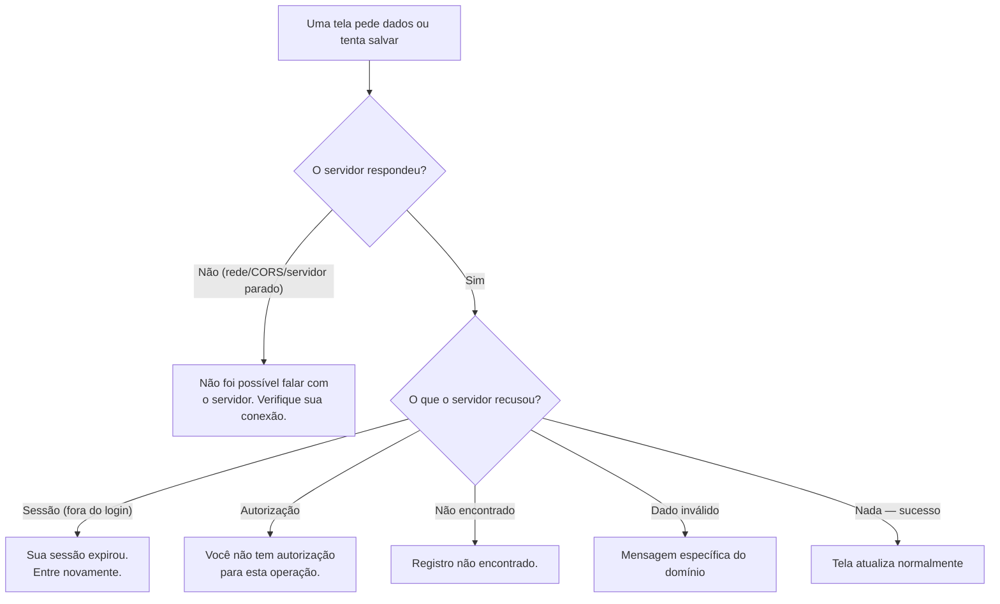

# 17. Sessão, conectividade e mensagens de erro

> **Contexto:** este documento faz parte do *Manual de Utilização — Sistema Markup*, ferramenta de precificação estratégica por Markup Divisor (`PV = CP / Divisor`). Veja o índice completo em [`00-indice.md`](./00-indice.md). Complementa [`02-login.md`](./02-login.md), que trata da autenticação em si.

O sistema conversa com o backend via GraphQL. Toda vez que uma tela não consegue carregar dados ou salvar algo, a mensagem exibida depende do **tipo de erro** — nunca aparece um erro técnico bruto (stack trace, código HTTP) para quem está usando o sistema.

## 17.1 Por que isso importa

Sem essa distinção, um backend fora do ar apareceria como **"nenhum registro encontrado"** em qualquer lista — e o usuário concluiria, errado, que perdeu seus dados. O sistema trata **erro de rede** e **lista vazia** como coisas fundamentalmente diferentes.

## 17.2 Tipos de erro e suas mensagens

| Situação | Mensagem exibida | Onde aparece tipicamente |
|---|---|---|
| E-mail/senha incorretos, ou usuário inativo | *"E-mail ou senha inválidos."* | Tela de login |
| Sessão expirada (token ausente/inválido) no meio de uma ação | *"Sua sessão expirou. Entre novamente."* — leva de volta ao login | Qualquer tela, durante o uso |
| Autenticado, mas sem autorização para aquela operação | *"Você não tem autorização para esta operação."* | Ações bloqueadas pelo RBAC (ver [`14-perfis-rbac.md`](./14-perfis-rbac.md)) |
| Registro não encontrado no servidor | *"Registro não encontrado."* | Abrir um produto/empresa que foi removido por outra pessoa |
| O domínio recusou o dado enviado (ex.: alíquota negativa) | Mensagem específica do backend, mais detalhada que o padrão | Formulários, ao salvar |
| Sem resposta do servidor (rede, CORS, backend parado) | *"Não foi possível falar com o servidor. Verifique sua conexão."* | Qualquer consulta ou ação |
| Erro não classificado | *"Algo deu errado. Tente novamente."* | Casos residuais |

## 17.3 Sessão expirando durante o uso

Se um token expira enquanto você está em qualquer tela do sistema (não no momento do login), você é levado de volta à tela de login com o aviso neutro *"Sua sessão expirou. Entre novamente."* — sem alarme de erro, porque não foi uma ação sua que falhou. Depois de entrar de novo, você retoma o uso normalmente.

Para os detalhes de como o access token e o refresh token funcionam (por que o F5 não pede senha, e por quanto tempo a sessão sobrevive), veja [`02-login.md`](./02-login.md), item 2.1.

## 17.4 Boas práticas ao reportar um problema

Ao relatar um erro para o suporte, é útil informar:
1. A **mensagem exata** exibida na tela (uma das listadas em 17.2).
2. A **tela e a ação** que estava sendo feita (ex.: "salvando um novo produto na tela de Produtos").
3. Se o erro se repete ao tentar de novo, ou se aconteceu uma única vez (indício de instabilidade de rede pontual).
